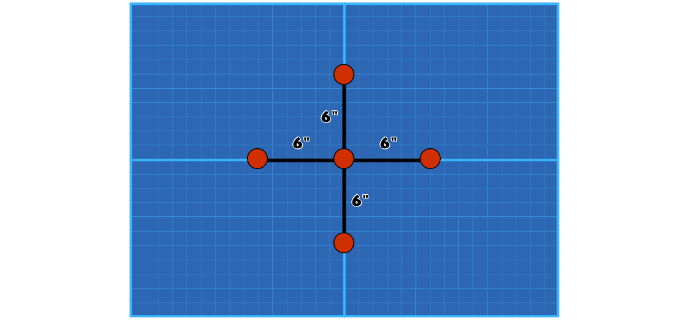
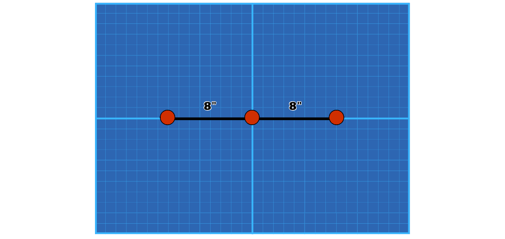

# Victory Condition

## **6.3 Victory** {#6.3-victory}

Randomly select **Victory**: This will tell you how to calculate victory points for the game to determine the winner.

---

## 6.3.1 Victory Conditions

### Treasure Objectives

| 1D6 | Name | Victory Condition |
|:---:|:----|:----|
| 1 | **Recover Supplies** | Five treasures are placed on the board, the first in the centre and the remaining 4 placed 6 inches away along the central lines. After 4 rounds, the player with the most fighters carrying treasure wins. |
| 2 | **Secure the Intel** | Place 1 central treasure. The carrier takes damage 3 at the end of each activation. After 4 rounds, the player carrying it wins; otherwise, the player with the most fighters within 3" of it wins.|

 

 Recover Supplies treasure map

### Area Control Objectives

| 1D6 | Name | Victory Condition |
|:---:|:----|:----|
| 3 | **Hold Ground** | Divide the battlefield into 4 quarters. After 4 rounds, a player controls a quarter if they have more fighters within it than their opponent. The player controlling the most quarters wins. |
| 4 | **Capture Objectives** | Place 3 objective markers, one in the centre and the other two 8 inches away on either side along the long centre line. After 4 rounds, the player controlling the most objectives wins. A player controls an objective if they have more fighters within 3" of it than their opponent. |

 
 Capture objectives map

### Elimination Objectives

| 1D6 | Name | Victory Condition |
|:---:|:----|:----|
| 5 | **Assassinate Target** | The first player to take down the enemy Leader wins immediately. |
| 6 | **6. Attrition** | At the end of each battle round, score 1 point if fewer of your fighters are damaged or taken down than your opponent. After 4 rounds, the player with the most points wins. |

---

## **Objective rules**

A player gains control of an objective if, at the end of a battle round, they have more friendly fighters within 3" of it than there are enemy fighters within 3" of it. Once a player gains control of an objective, it remains under their control until another player gains control of it.

---

## **Treasure rules**

If at any point during a move action a fighter moves within 1" of a treasure token, the fighter can pick up that treasure. Remove the token from the battlefield. That fighter is now carrying that treasure. A fighter cannot pick up treasure if they are already carrying treasure. If a fighter begins a move action carrying treasure, subtract 2 from their Move characteristic for that move action (to a minimum of 3). In addition, fighters cannot make disengage actions while carrying treasure.

A fighter carrying treasure can use an action to drop the treasure. If a fighter carrying treasure is taken down, they automatically drop the treasure before the fighter's model is removed from play. In both cases, the player controlling that fighter picks a point on a platform or the battlefield floor that is within 1" horizontally of the fighter, visible to the fighter, and either vertically level to or any distance vertically lower than the fighter, and places the treasure token there.

---