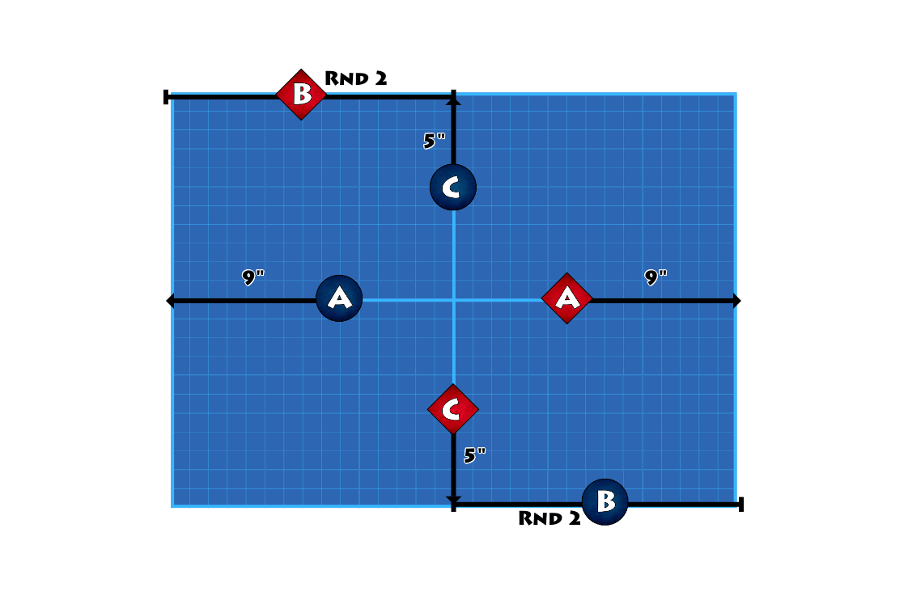
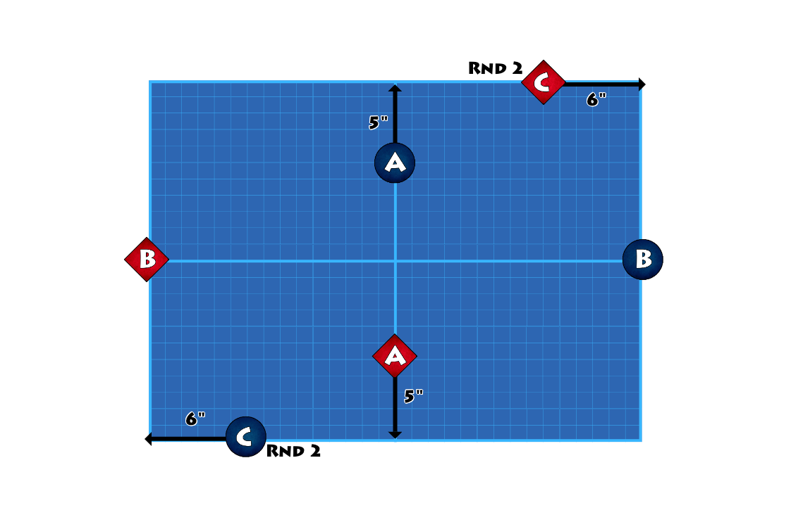
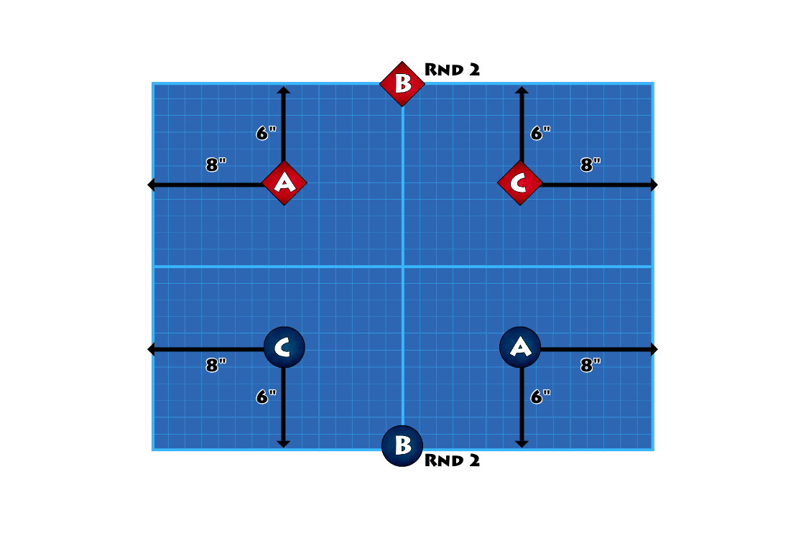
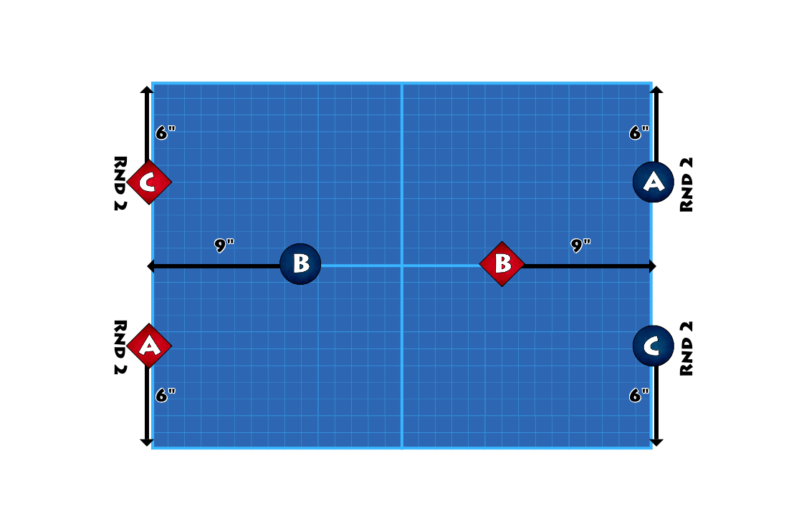
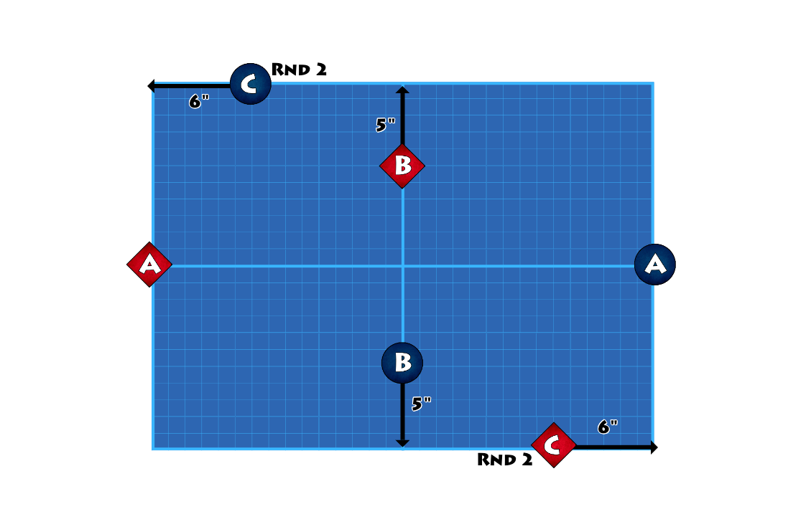
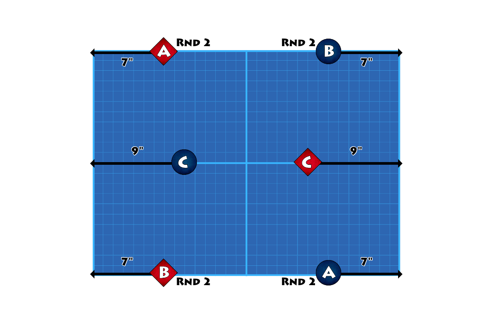

# Deployment

The game starts with the action already under way. Rather than lining up at each side of the Mission, the three Deployment groups for each Warband are placed on the table based on a randomly selected deployment map.

## **6.5 Deployment** {#6.5-deployment}

- Randomly select Deployment to determine the placement of A, B, and C deployemnt groups. This is drawn from a deployment deck or randomly rolled.
- Deployment may have a simple indicating which way is 'North', if it does not, then assume the upper long board edge based on the text is 'North'. Use this to align with the board to determine which way is which.
- Randomly determine who is the 'attacker' and who is the 'defender'. Consult the deployments to see how the different sides are determined, this might be red vs blue, diamond versus circle, or something similar. Randomly decide which is which.
- Sometimes units will not deploy on the first turn but may deploy in a later turn, this will be indicated with a RND 2, RND 3, or RND 4 depending on the turn they arrive.
- Fighters are placed on the board during the Reserve phase of the Mission round.

:::info Philosophy
Deployment maps have three purposes. a) They remove the deployment back and forth where players attempt to out-maneover before the first shot is fired. While this can be fun it can sometimes overshadow the rest of the game. b) As the deployment locations are already on the board this removes the turn one or slowly matching towards the enemy. There is a certain element of that but the maps will often have two groups hostile to each other quite close to each other. c) As the maps are randomly selected this adds a certain amount of battlefield chaos that the players must overcome.
:::

## **6.5.1 Example Deployments** {#deployments}

**Deployment 1**

**Deployment 2**

**Deployment 3**

**Deployment 4**

**Deployment 5**

**Deployment 6**

